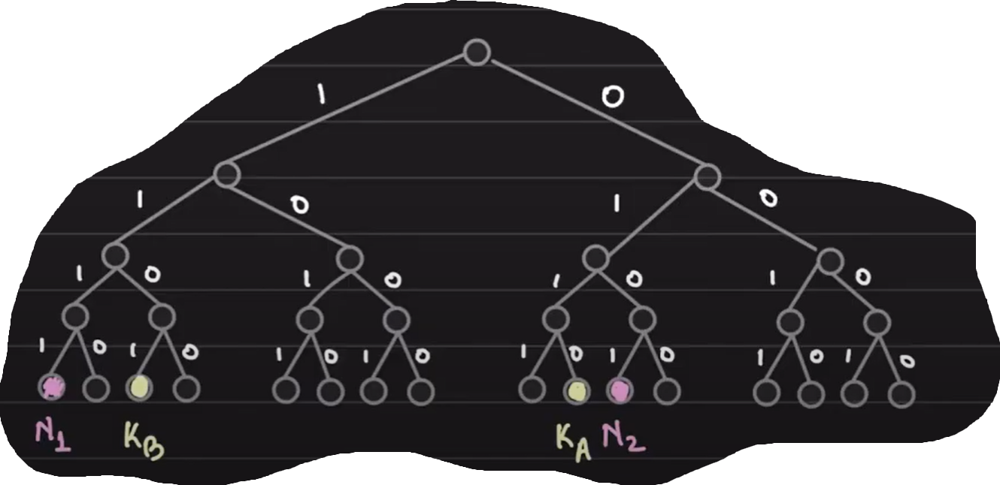
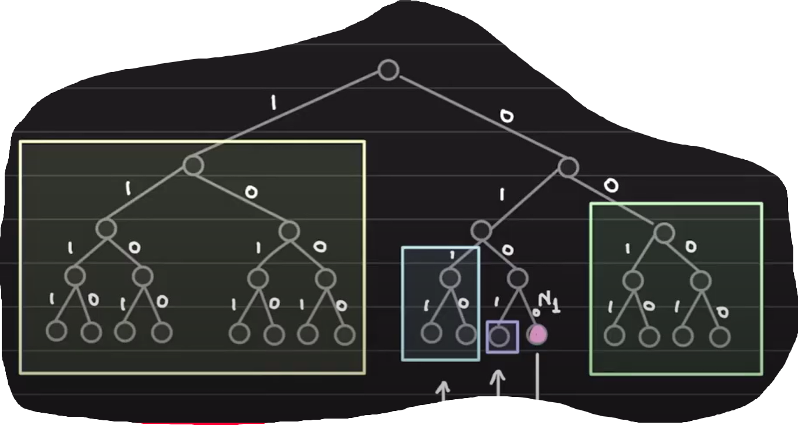

# Dev plan for toyrrent

## Distributed Key Value Store
Imagine data so large that one server cannot store it, we need to split the data into multiple nodes.
So, say there are `n` nodes storing some key values as shown in this table

| Node | Key        |
| ---- | ---        |
| n1   | ka, kb, kc |
| n2   | kd         |
| n3   | ka, ke     |

Now, a new node `n4` comes and establishes contact with `n2`. This new node `n4` wants `ke`, but `n2` unfortunately does not have it.
We should be able to handle this very case.

So _any_ **new** node connecting to _any_ node can ask for _any_ key.

## Problem: Node discovery
A single node cannot store information about all the available nodes (it might but we want to make it scalable to some extent).

### Solution: Kademlia
A solution to pure p2p distributed key value store, wikipedia article [here](https://en.wikipedia.org/wiki/Kademlia#:~:text=Kademlia%20is%20a%20distributed%20hash,and%20David%20Mazi%C3%A8res%20in%202002.).
Nice video explanation is [here](https://www.youtube.com/watch?v=_kCHOpINA5g)

### Unique identifiers
Each node is assigned a random 160 bit identifier. Same goes for the keys as well.
This can be achieved by passing the node ids and key ids through SHA1 to produce 160 bit hashes for these.

## Data Ownership
Given a key `k` and the set of nodes, how to decide on which node this key should reside?

**Idea**: Calculate some sort of distance between the key and nodes and select the node which is _closest_ to key.

How to define the distance then? It should follow the follwoing three properties:
- distance(x, x) = 0; distance of some entity from itself should be zero
- distance(x, y) > 0 if x != y; distance of two different entities must be positive
- distance(x, y) + distance(y, z) >= distance(x, z); triangle inequality

Since `x` and `y` here would be 160 bit ids, we need a function which would work well with this. One such funciton which would work is the XOR function.
***XOR*** satisfies all three properties which we need in this case:
- d(x, x) = x ^ x = 0
- d(x, y) = x ^ y > 0
- d(x, y) + d(y, z) = (x ^ y) ^ (y ^ z) = x ^ z = d(x, z)

An example showing what we mean with this: say we are working with 4 bit ids to keep things simple

| Entity    | ID | Bit representation |
| ----      | ---| ---                |
| node `n1` | 15 | 1111               |
| node `n2` |  5 | 0101               |
| key  `ka` |  6 | 0110               |
| key  `kb` | 13 | 1101               |

d(ka, n1) = 0110 ^ 1111 = 1001 = 9
d(ka, n2) = 0110 ^ 0101 = 0011 = 3
since 3 < 9, key `ka` should reside with node `n2`

This can be visualised with a complete binary tree as follows

We can see how `ka` is closer to `n2` in that case

## Routing
Nodes must know some other nodes so that information can be passed. But we want to avoid storing information of all nodes. This is where the tree structure would come handy.

**Idea**: Every node knows at least one node in each **subtree** that it is _not_ part of

So node `n1` must store contact in the 4 subtrees 1, 00, 011, 0101. This ensures any node can get information on any other node easily without storing all node addresses.

